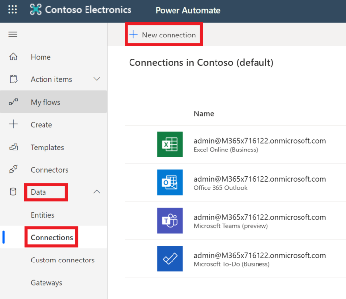
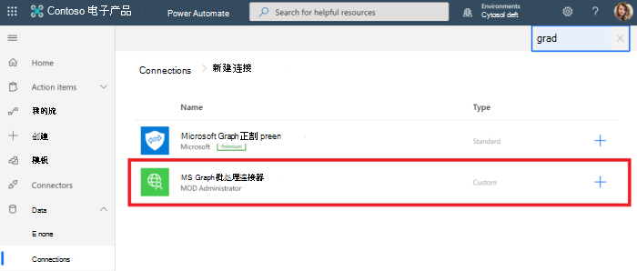
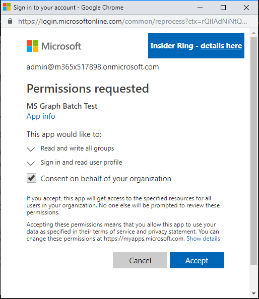

<!-- markdownlint-disable MD002 MD041 -->

确保连接器可供使用的最后一个配置步骤是授权和测试自定义连接器以创建缓存的连接。The final configuration step to ensure the connector is ready for use is to authorize and test the custom connector to create a cached connection.

> [!IMPORTANT]
> 以下步骤要求您使用管理员权限登录。The following steps requires that you are logged in with administrator privileges.

在 [Microsoft 电力自动化](https://flow.microsoft.com)中，转到左侧的 " **数据** " 菜单项，然后选择 " **连接** " 页。In [Microsoft Power Automate](https://flow.microsoft.com), go to the **Data** menu item on the left and choose the **Connections** page. 选择 " **新建连接** " 链接。Choose the **New Connection** link.

通过单击加号按钮找到您的自定义连接器并完成连接。Find your custom connector and complete the connection by clicking the plus button. 使用 Office 365 租户管理员的 Azure Active Directory 帐户登录。Sign in with your Office 365 tenant administrator's Azure Active Directory account.

当系统提示您输入请求的权限时，请选中 " **代表您的组织同意"** ，然后选择 " **接受** " 以授权权限。When prompted for the requested permissions, check **Consent on behalf of your organization** and then choose **Accept** to authorize permissions.

授权权限后，会在 "自动使用电源" 中创建连接。After you authorize the permissions, a connection is created in Power Automate.

现在已配置并启用自定义连接器。The custom connector is now configured and enabled. 可能在应用权限中存在延迟且可用，但现在已配置连接器。There may be a delay in permissions being applied and available, but the connector is now configured.
