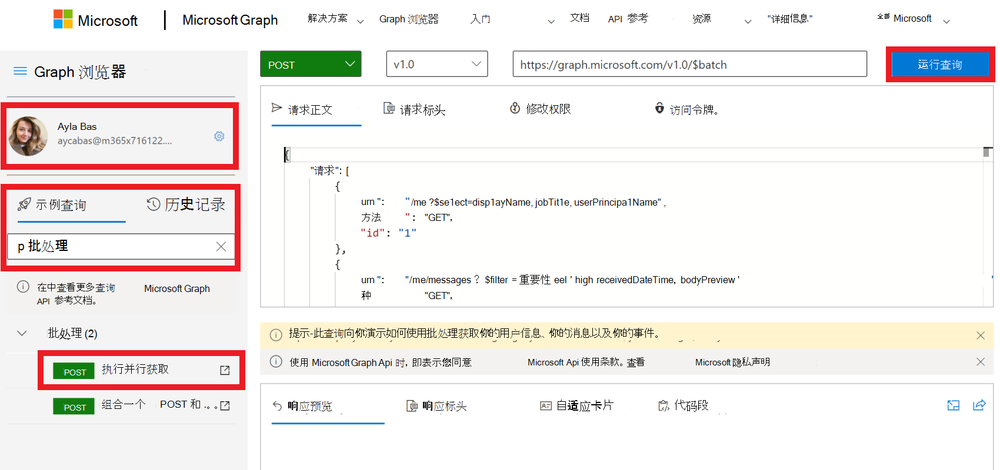
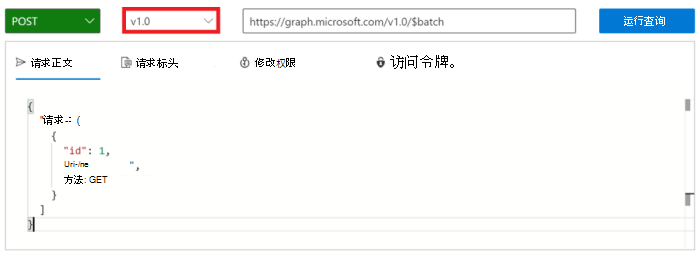
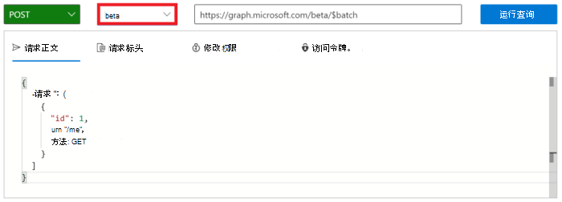

<!-- markdownlint-disable MD002 MD041 -->

<span data-ttu-id="ba7d4-101">在创建使用新连接器的流之前，请使用 [Microsoft Graph 资源管理器](https://developer.microsoft.com/graph/graph-explorer) 在 microsoft graph 中发现 JSON 批处理的一些功能和功能。</span><span class="sxs-lookup"><span data-stu-id="ba7d4-101">Before creating a Flow to consume the new connector, use [Microsoft Graph Explorer](https://developer.microsoft.com/graph/graph-explorer) to discover some of the capabilities and features of JSON batching in Microsoft Graph.</span></span>

<span data-ttu-id="ba7d4-102">在浏览器中打开 [Microsoft Graph 资源管理器](https://developer.microsoft.com/graph/graph-explorer) 。</span><span class="sxs-lookup"><span data-stu-id="ba7d4-102">Open the [Microsoft Graph Explorer](https://developer.microsoft.com/graph/graph-explorer) in your browser.</span></span> <span data-ttu-id="ba7d4-103">使用 Office 365 租户管理员帐户登录。</span><span class="sxs-lookup"><span data-stu-id="ba7d4-103">Sign in with your Office 365 tenant administrator account.</span></span> <span data-ttu-id="ba7d4-104">从**示例查询**中搜索**批次**。</span><span class="sxs-lookup"><span data-stu-id="ba7d4-104">Search for for **Batch** from the **Sample queries**.</span></span>

<span data-ttu-id="ba7d4-105">在左侧菜单中选择 " **执行并行获取** 示例" 查询。</span><span class="sxs-lookup"><span data-stu-id="ba7d4-105">Select the **Perform parallel GETs** sample query in the left menu.</span></span> <span data-ttu-id="ba7d4-106">选择屏幕右上角的 " **运行查询** " 按钮。</span><span class="sxs-lookup"><span data-stu-id="ba7d4-106">Choose the **Run Query** button at the top right of the screen.</span></span>



<span data-ttu-id="ba7d4-108">示例批处理操作批处理三个 HTTP GET 请求，并向 Graph 终结点发出单个 HTTP POST `/v1.0/$batch` 。</span><span class="sxs-lookup"><span data-stu-id="ba7d4-108">The sample batch operation batches three HTTP GET requests and issues a single HTTP POST to the `/v1.0/$batch` Graph endpoint.</span></span>

```json
{
    "requests": [
        {
            "url": "/me?$select=displayName,jobTitle,userPrincipalName",
            "method": "GET",
            "id": "1"
        },
        {
            "url": "/me/messages?$filter=importance eq 'high'&$select=from,subject,receivedDateTime,bodyPreview",
            "method": "GET",
            "id": "2"
        },
        {
            "url": "/me/events",
            "method": "GET",
            "id": "3"
        }
    ]
}
```

<span data-ttu-id="ba7d4-109">返回的响应如下所示。</span><span class="sxs-lookup"><span data-stu-id="ba7d4-109">The response returned is shown below.</span></span> <span data-ttu-id="ba7d4-110">记下 Microsoft Graph 返回的响应的数组。</span><span class="sxs-lookup"><span data-stu-id="ba7d4-110">Note the array of responses that is returned by Microsoft Graph.</span></span> <span data-ttu-id="ba7d4-111">对批处理请求的响应可能以不同于 POST 中请求顺序的顺序出现。</span><span class="sxs-lookup"><span data-stu-id="ba7d4-111">The responses to the batched requests may appear in a different order than the order of the requests in the POST.</span></span> <span data-ttu-id="ba7d4-112">`id`应使用属性将各个批次请求与特定批次响应关联。</span><span class="sxs-lookup"><span data-stu-id="ba7d4-112">The `id` property should be used to correlate individual batch requests with specific batch responses.</span></span>

> [!NOTE]
> <span data-ttu-id="ba7d4-113">为了提高可读性，响应已被截断。</span><span class="sxs-lookup"><span data-stu-id="ba7d4-113">The response has been truncated for readability.</span></span>

```json
{
  "responses": [
    {
      "id": "1",
      "status": 200,
      "headers": {...},
      "body": {...}
    },
    {
      "id": "3",
      "status": 200,
      "headers": {...},
      "body": {...}
    }
    {
      "id": "2",
      "status": 200,
      "headers": {...},
      "body": {...}
    }
  ]
}
```

<span data-ttu-id="ba7d4-114">每个响应都包含 `id` 、、 `status` `headers` 和 `body` 属性。</span><span class="sxs-lookup"><span data-stu-id="ba7d4-114">Each response contains an `id`, `status`, `headers`, and `body` property.</span></span> <span data-ttu-id="ba7d4-115">如果 `status` 请求的属性指示失败，则 `body` 包含从请求返回的任何错误消息。</span><span class="sxs-lookup"><span data-stu-id="ba7d4-115">If the `status` property for a request indicates a failure, the `body` contains any error information returned from the request.</span></span>

<span data-ttu-id="ba7d4-116">若要确保请求的操作的顺序，可以使用 [dependsOn](https://docs.microsoft.com/graph/json-batching#sequencing-requests-with-the-dependson-property) 属性对单个请求进行排序。</span><span class="sxs-lookup"><span data-stu-id="ba7d4-116">To ensure an order of operations for the requests, individual requests can be sequenced using the [dependsOn](https://docs.microsoft.com/graph/json-batching#sequencing-requests-with-the-dependson-property) property.</span></span>

<span data-ttu-id="ba7d4-117">除序列化和依赖项操作外，JSON 批处理还假定一个基路径，并执行相对路径中的请求。</span><span class="sxs-lookup"><span data-stu-id="ba7d4-117">In addition to sequencing and dependency operations, JSON batching assumes a base path and executes the requests from a relative path.</span></span> <span data-ttu-id="ba7d4-118">每个批处理请求元素都 `/v1.0/$batch` `/beta/$batch` 按指定方式从或终结点执行。</span><span class="sxs-lookup"><span data-stu-id="ba7d4-118">Each batch request element is executed from either the `/v1.0/$batch` OR `/beta/$batch` endpoints as specified.</span></span> <span data-ttu-id="ba7d4-119">由于 `/beta` 终结点可能返回可能不会在终结点中返回的其他输出，因此这可能会产生重大差异 `/v1.0` 。</span><span class="sxs-lookup"><span data-stu-id="ba7d4-119">This can have significant differences as the `/beta` endpoint may return additional output which may NOT be returned in the `/v1.0` endpoint.</span></span>

<span data-ttu-id="ba7d4-120">例如，在 [Microsoft Graph 资源管理器](https://developer.microsoft.com/graph/graph-explorer)中执行以下两个查询。</span><span class="sxs-lookup"><span data-stu-id="ba7d4-120">For example, execute the following two queries in the [Microsoft Graph Explorer](https://developer.microsoft.com/graph/graph-explorer).</span></span>

1. <span data-ttu-id="ba7d4-121">`/v1.0/$batch`使用以下 url 查询终结点 `/me` () 的复制和粘贴请求。</span><span class="sxs-lookup"><span data-stu-id="ba7d4-121">Query the `/v1.0/$batch` endpoint using the url `/me` (copy and paste request below).</span></span>

```json
{
  "requests": [
    {
      "id": 1,
      "url": "/me",
      "method": "GET"
    }
  ]
}
```



<span data-ttu-id="ba7d4-123">现在，使用版本选择器下拉箭头更改为 `beta` 终结点，并执行完全相同的请求。</span><span class="sxs-lookup"><span data-stu-id="ba7d4-123">Now use the version selector drop-down to change to the `beta` endpoint, and make the exact same request.</span></span>



<span data-ttu-id="ba7d4-125">返回的结果有何区别？</span><span class="sxs-lookup"><span data-stu-id="ba7d4-125">What are the differences in the results returned?</span></span> <span data-ttu-id="ba7d4-126">尝试其他一些查询来确定一些差异。</span><span class="sxs-lookup"><span data-stu-id="ba7d4-126">Try some other queries to identify some of the differences.</span></span>

<span data-ttu-id="ba7d4-127">除了和终结点的不同响应内容 `/v1.0` 之外 `/beta` ，在发出批处理请求以获得尚未授予的权限时，务必要了解可能存在的错误。</span><span class="sxs-lookup"><span data-stu-id="ba7d4-127">In addition to different response content from the `/v1.0` and `/beta` endpoints, it is important to understand the possible errors when a batch request is made for which permission consent has not been granted.</span></span> <span data-ttu-id="ba7d4-128">例如，下面是创建 OneNote 笔记本的批处理请求项。</span><span class="sxs-lookup"><span data-stu-id="ba7d4-128">For example, the following is a batch request item to create a OneNote Notebook.</span></span>

```json
{
  "id": 1,
  "url": "/groups/65c5ecf9-3311-449c-9904-29a2c76b9a50/onenote/notebooks",
  "headers": {
    "Content-Type": "application/json"
  },
  "method": "POST",
  "body": {
    "displayName": "Meeting Notes"
  }
}
```

<span data-ttu-id="ba7d4-129">但是，如果尚未授予创建 OneNote 笔记本的权限，则会收到以下响应。</span><span class="sxs-lookup"><span data-stu-id="ba7d4-129">However, if the permissions to create OneNote Notebooks has not been granted, the following response is received.</span></span> <span data-ttu-id="ba7d4-130">注意状态代码 `403 (Forbidden)` 和错误消息，指示提供的 OAuth 令牌不包括完成请求的操作所需的范围。</span><span class="sxs-lookup"><span data-stu-id="ba7d4-130">Note the status code `403 (Forbidden)` and the error message which indicates the OAuth token provided does not include the scopes required to completed the requested action.</span></span>

```json
{
  "responses": [
    {
      "id": "1",
      "status": 403,
      "headers": {
        "Cache-Control": "no-cache"
      },
      "body": {
        "error": {
          "code": "40004",
          "message": "The OAuth token provided does not have the necessary scopes to complete the request.
            Please make sure you are including one or more of the following scopes: Notes.ReadWrite.All,
            Notes.Read.All (you provided these scopes: Group.Read.All,Group.ReadWrite.All,User.Read,User.Read.All)",
          "innerError": {
            "request-id": "92d50317-aa06-4bd7-b908-c85ee4eff0e9",
            "date": "2018-10-17T02:01:10"
          }
        }
      }
    }
  ]
}
```

<span data-ttu-id="ba7d4-131">批处理中的每个请求将返回状态代码和结果或错误消息。</span><span class="sxs-lookup"><span data-stu-id="ba7d4-131">Each request in your batch will return a status code and results or error information.</span></span> <span data-ttu-id="ba7d4-132">您必须处理每个响应，以便确定单个批处理操作是成功还是失败。</span><span class="sxs-lookup"><span data-stu-id="ba7d4-132">You must process each of the responses in order to determine success or failure of the individual batch operations.</span></span>
