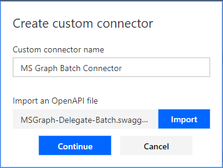

<!-- markdownlint-disable MD002 MD041 -->

在本练习中，将创建一个新的自定义连接器，该连接器可在流中或在 Azure 逻辑应用中使用。 将使用 Microsoft Graph `$batch`终结点的正确路径预建 Open API 定义文件，并使用其他设置来启用简单导入。

使用文本编辑器，创建一个名为`MSGraph-Delegate-Batch.swagger.json`的新的空文件，并添加以下代码。

[!code-json]

打开浏览器并导航到[Microsoft Flow](https://flow.microsoft.com)。 使用 Office 365 租户管理员帐户登录。 选择右上角的齿轮图标，然后选择下拉菜单中的 "**自定义连接器**" 项。

在 "**自定义连接器**" 页上，选择右上方的 "**创建自定义连接器**" 链接，然后在下拉菜单中选择 "**导入打开的 API 文件**" 项。

 

在`MS Graph Batch Connector` "**自定义连接器名称**" 文本框中输入。 选择要上传打开的 API 文件的文件夹图标。 浏览到您`MSGraph-Delegate-Batch.swagger.json`创建的文件。 选择 "**继续**" 以上传打开的 API 文件。

 

在 "连接器配置" 页上，选择 "导航" 菜单中的 "**安全**" 链接。 按如下所示填写字段。

- **选择您的 API 实现的身份验证**：`OAuth 2.0`
- **标识提供程序**：`Azure Active Directory`
- **客户端 id**：在上一练习中创建的应用程序 id
- **客户端密码**：在上一练习中创建的密钥
- **登录 url**：`https://login.windows.net`
- **租户 ID**：`common`
- **资源 URL**： `https://graph.microsoft.com` （无尾随/）
- **范围**：保留为空

选择右上方的 "**创建连接器**"

创建连接器后，复制生成的**重定向 URL**。

返回到在上一练习中创建的[Azure 门户](https://aad.portal.azure.com)中已注册的应用程序。 选择 "**设置**" 边栏选项卡中的 "**答复 url** "。 添加作为附加**回复 url**复制的**重定向 url** 。 在 Azure Active Directory 门户中保存应用程序。

