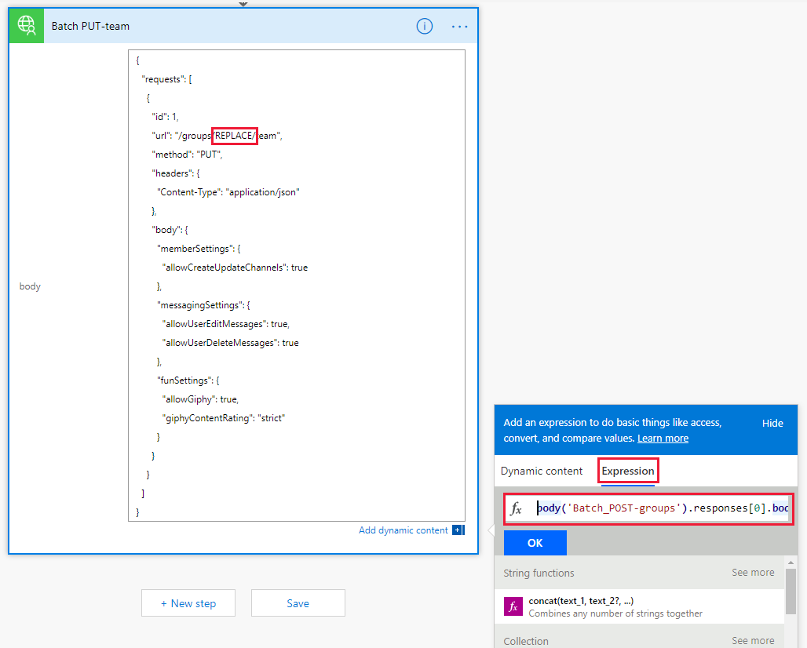

<!-- markdownlint-disable MD002 MD041 -->

<span data-ttu-id="29e7e-101">在本练习中, 将创建一个流, 以使用您在前面的练习中创建的自定义连接器, 以创建和配置 Microsoft 团队。</span><span class="sxs-lookup"><span data-stu-id="29e7e-101">In this exercise, you will create a Flow to use the custom connector you created in previous exercises to create and configure a Microsoft Team.</span></span> <span data-ttu-id="29e7e-102">流将使用自定义连接器发送 POST 请求来创建 Office 365 统一组, 在组创建完成时暂停延迟, 然后发送 PUT 请求, 将组与 Microsoft 团队相关联。</span><span class="sxs-lookup"><span data-stu-id="29e7e-102">The Flow will use the custom connector to send a POST request to create an Office 365 Unified Group, will pause for a delay while the group creation completes, and then will send a PUT request to associate the group with a Microsoft Team.</span></span>

<span data-ttu-id="29e7e-103">在末尾, 您的流看起来将类似于下图:</span><span class="sxs-lookup"><span data-stu-id="29e7e-103">In the end your Flow will look similar to the following image:</span></span>


<span data-ttu-id="29e7e-105">在浏览器中打开[Microsoft 流](https://flow.microsoft.com), 并使用 Office 365 租户管理员帐户登录。</span><span class="sxs-lookup"><span data-stu-id="29e7e-105">Open [Microsoft Flow](https://flow.microsoft.com) in your browser and sign in with your Office 365 tenant administrator account.</span></span> <span data-ttu-id="29e7e-106">在左侧导航栏中选择 **"我的流**"。</span><span class="sxs-lookup"><span data-stu-id="29e7e-106">Choose **My Flows** in the left-hand navigation.</span></span> <span data-ttu-id="29e7e-107">依次选择 "**新建**" 和 "**从空白创建**"。</span><span class="sxs-lookup"><span data-stu-id="29e7e-107">Choose **New**, then **Create from blank**.</span></span> <span data-ttu-id="29e7e-108">选择 "**从空白创建**"。</span><span class="sxs-lookup"><span data-stu-id="29e7e-108">Choose **Create from blank**.</span></span> <span data-ttu-id="29e7e-109">在`Manual`搜索框中输入并添加**手动触发流**触发器。</span><span class="sxs-lookup"><span data-stu-id="29e7e-109">Enter `Manual` in the search box and add the **Manually trigger a flow** trigger.</span></span>

<span data-ttu-id="29e7e-110">选择 "**添加输入**", 选择 "**文本**", 然后输入`Name`作为标题。</span><span class="sxs-lookup"><span data-stu-id="29e7e-110">Choose **Add an input**, select **Text** and enter `Name` as the title.</span></span>


<span data-ttu-id="29e7e-112">选择 "**新建步骤**" `Batch` , 然后在搜索框中键入。</span><span class="sxs-lookup"><span data-stu-id="29e7e-112">Choose **New step** and type `Batch` in the search box.</span></span> <span data-ttu-id="29e7e-113">添加**MS Graph 批处理连接器**操作。</span><span class="sxs-lookup"><span data-stu-id="29e7e-113">Add the **MS Graph Batch Connector** action.</span></span> <span data-ttu-id="29e7e-114">选择省略号, 并将此操作重`Batch POST-groups`命名为。</span><span class="sxs-lookup"><span data-stu-id="29e7e-114">Choose the ellipsis and rename this action to `Batch POST-groups`.</span></span>

<span data-ttu-id="29e7e-115">将以下代码添加到操作的 "**正文**" 文本框中。</span><span class="sxs-lookup"><span data-stu-id="29e7e-115">Add the following code into the **body** text box of the action.</span></span>

```json
{
  "requests": [
    {
      "url": "/groups",
      "method": "POST",
      "id": 1,
      "headers": { "Content-Type": "application/json" },
      "body": {
        "description": "REPLACE",
        "displayName": "REPLACE",
        "groupTypes": ["Unified"],
        "mailEnabled": true,
        "mailNickname": "REPLACE",
        "securityEnabled": false
      }
    }
  ]
}
```

<span data-ttu-id="29e7e-116">通过从`REPLACE` " `Name` **添加动态内容**" 菜单中选择手动触发器中的值来替换每个占位符。</span><span class="sxs-lookup"><span data-stu-id="29e7e-116">Replace each `REPLACE` placeholder by selecting the `Name` value from the manual trigger from the **Add dynamic content** menu.</span></span>


<span data-ttu-id="29e7e-118">依次选择 "**新建步骤**" `delay` 、"搜索和添加**延迟**" 操作和 "配置为1分钟"。</span><span class="sxs-lookup"><span data-stu-id="29e7e-118">Choose **New step**, search for `delay` and add a **Delay** action and configure for 1 minute.</span></span>

<span data-ttu-id="29e7e-119">选择 "**新建步骤**" `Batch` , 然后在搜索框中键入。</span><span class="sxs-lookup"><span data-stu-id="29e7e-119">Choose **New step** and type `Batch` in the search box.</span></span> <span data-ttu-id="29e7e-120">添加**MS Graph 批处理连接器**操作。</span><span class="sxs-lookup"><span data-stu-id="29e7e-120">Add the **MS Graph Batch Connector** action.</span></span> <span data-ttu-id="29e7e-121">选择省略号, 并将此操作重`Batch PUT-team`命名为。</span><span class="sxs-lookup"><span data-stu-id="29e7e-121">Choose the ellipsis and rename this action to `Batch PUT-team`.</span></span>

<span data-ttu-id="29e7e-122">将以下代码添加到操作的 "**正文**" 文本框中。</span><span class="sxs-lookup"><span data-stu-id="29e7e-122">Add the following code into the **body** text box of the action.</span></span>

```json
{
  "requests": [
    {
      "id": 1,
      "url": "/groups/REPLACE/team",
      "method": "PUT",
      "headers": {
        "Content-Type": "application/json"
      },
      "body": {
        "memberSettings": {
          "allowCreateUpdateChannels": true
        },
        "messagingSettings": {
          "allowUserEditMessages": true,
          "allowUserDeleteMessages": true
        },
        "funSettings": {
          "allowGiphy": true,
          "giphyContentRating": "strict"
        }
      }
    }
  ]
}
```

<span data-ttu-id="29e7e-123">选择`REPLACE`占位符, 然后选择 "动态内容" 窗格中的 "**表达式**"。</span><span class="sxs-lookup"><span data-stu-id="29e7e-123">Select the `REPLACE` placeholder, then select **Expression** in the dynamic content pane.</span></span> <span data-ttu-id="29e7e-124">将以下公式添加到**表达式**中。</span><span class="sxs-lookup"><span data-stu-id="29e7e-124">Add the following formula into the **Expression**.</span></span>

```js
body('Batch_POST-groups').responses[0].body.id
```



<span data-ttu-id="29e7e-126">此公式指定我们希望从第一个操作的结果中使用组 ID。</span><span class="sxs-lookup"><span data-stu-id="29e7e-126">This formula specifies that we want to use the group ID from the result of the first action.</span></span>


<span data-ttu-id="29e7e-128">依次选择 "**保存**" 和 "流", 然后选择 "**测试**" 以执行流。</span><span class="sxs-lookup"><span data-stu-id="29e7e-128">Choose **Save**, then Flow and choose **Test** to execute the Flow.</span></span>

> [!TIP]
> <span data-ttu-id="29e7e-129">如果收到类似于`The template validation failed: 'The action(s) 'Batch_POST-groups' referenced by 'inputs' in action 'Batch_2' are not defined in the template'`的错误, 表达式是错误的, 并且可能引用了无法找到的流操作。</span><span class="sxs-lookup"><span data-stu-id="29e7e-129">If you receive an error like `The template validation failed: 'The action(s) 'Batch_POST-groups' referenced by 'inputs' in action 'Batch_2' are not defined in the template'`, the expression is incorrect and likely references a Flow action it cannot find.</span></span> <span data-ttu-id="29e7e-130">确保要引用的操作名称完全匹配。</span><span class="sxs-lookup"><span data-stu-id="29e7e-130">Ensure that the action name you are referencing matches exactly.</span></span>

<span data-ttu-id="29e7e-131">选择 "**我将执行触发操作"** 单选按钮, 然后选择 "**保存 & 测试**"。</span><span class="sxs-lookup"><span data-stu-id="29e7e-131">Choose the **I'll perform the trigger** action radio button and choose **Save & Test**.</span></span> <span data-ttu-id="29e7e-132">在对话框中选择 "**继续**"。</span><span class="sxs-lookup"><span data-stu-id="29e7e-132">Choose **Continue** in the dialog.</span></span> <span data-ttu-id="29e7e-133">提供一个不带空格的名称, 然后选择 "**运行流**" 以创建一个团队。</span><span class="sxs-lookup"><span data-stu-id="29e7e-133">Provide a name without spaces, and choose **Run flow** to create a Team.</span></span>


<span data-ttu-id="29e7e-135">最后, 选择 "**查看流运行活动**" 链接, 然后选择正在运行的流以查看活动日志。</span><span class="sxs-lookup"><span data-stu-id="29e7e-135">Finally, choose the **See flow run activity** link, then select the running Flow to see the activity log.</span></span>

> [!NOTE]
> <span data-ttu-id="29e7e-136">您可能需要单击 "运行历史记录" 列表中的正在运行的流实例以查看流执行。</span><span class="sxs-lookup"><span data-stu-id="29e7e-136">You may have to click on your running Flow instance in the Run history list to view your Flow execution.</span></span>

<span data-ttu-id="29e7e-137">流完成后, 你的 Office 365 组和团队已配置完毕。</span><span class="sxs-lookup"><span data-stu-id="29e7e-137">Once the Flow completes, your Office 365 Group and Team have been configured.</span></span> <span data-ttu-id="29e7e-138">选择 "批处理" 操作项以查看 JSON 批处理调用的结果。</span><span class="sxs-lookup"><span data-stu-id="29e7e-138">Select the Batch action items to view the results of the JSON Batch calls.</span></span> <span data-ttu-id="29e7e-139">`Batch PUT-team`操作`outputs`的状态代码应为成功的团队关联, 如下面的图像所示。</span><span class="sxs-lookup"><span data-stu-id="29e7e-139">The `outputs` of the `Batch PUT-team` action should have a status code of 201 for a successful Team association similar to the image below.</span></span>

