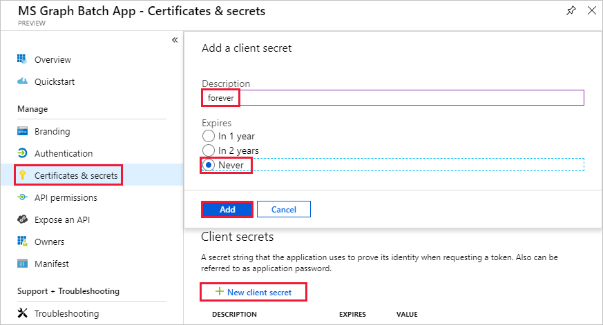

<!-- markdownlint-disable MD002 MD041 -->

在本练习中, 将创建一个新的 Azure Active Directory 应用程序, 该应用程序将用于为自定义连接器提供委派权限。

打开浏览器并导航到[Azure Active Directory 管理中心](https://aad.portal.azure.com)。 在左侧导航菜单中选择 " **Azure Active Directory** " 链接, 然后在**Azure active directory**边栏的 "**管理**" 部分中选择 "**应用注册 (预览)** " 条目。

选择 "**应用注册" (预览)** 刀片顶部的 "**新建注册**" 菜单项。

在`MS Graph Batch App` "**名称**" 字段中输入。 在 "**支持的帐户类型**" 部分, 选择**任意组织目录中的 "帐户"**。 将 "**重定向 URI** " 部分留空, 然后选择 "**注册**"。

在**MS Graph 批处理应用**边栏上, 复制**应用程序 (客户端) ID**。 在下一个练习中, 你将需要此操作。

在**MS Graph 批处理应用**边栏的 "**管理**" 部分中选择 " **API 权限**" 条目。 选择 " **API 权限**" 下**的 "添加权限**"。

在 "**请求 API 权限**" 边栏中, 选择 " **Microsoft Graph**", 然后选择 "**委派权限**"。 搜索`group`, 然后选择 "**读取和写入所有组**" 委派权限。 选择刀片式服务器底部的 "**添加权限**"。

 

在**MS Graph 批处理应用**边栏的 "**管理**" 部分中选择 "**证书和密码**" 条目, 然后选择 "**新建客户端密码**"。 在`forever` **说明**中输入, 然后选择 "**永不****过期**"。 选择“添加”****。

复制新项的键值。 在下一个练习中, 你将需要此操作。

> [!IMPORTANT]
> 此步骤非常关键, 因为关闭此边栏后将无法访问密钥。 将此项保存到文本编辑器中, 以便在即将进行的练习中使用。

若要启用对通过 Microsoft Graph (包括团队属性) 访问的其他服务的管理, 需要选择其他更合适的范围以启用管理特定服务。 例如, 若要扩展我们的解决方案以启用创建 OneNote 笔记本或 Planner 计划、存储桶和任务, 需要为相关 api 添加所需的权限范围。