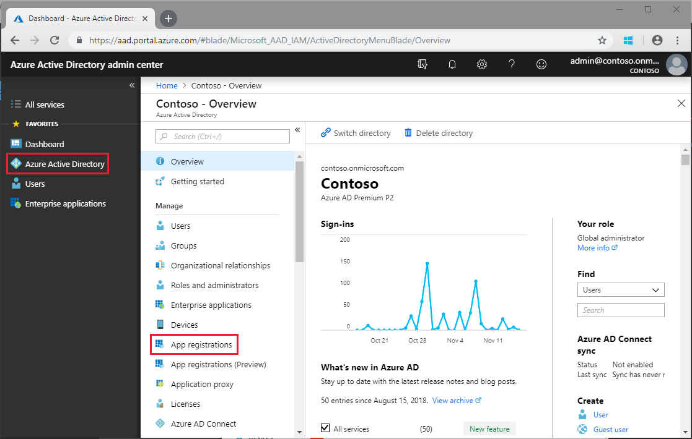
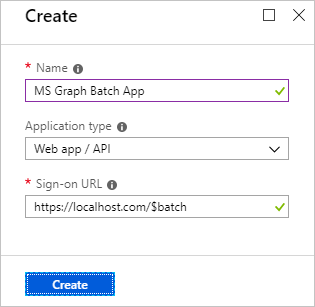
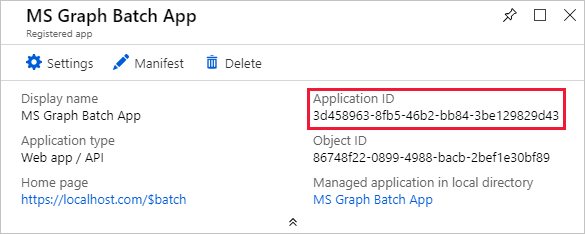
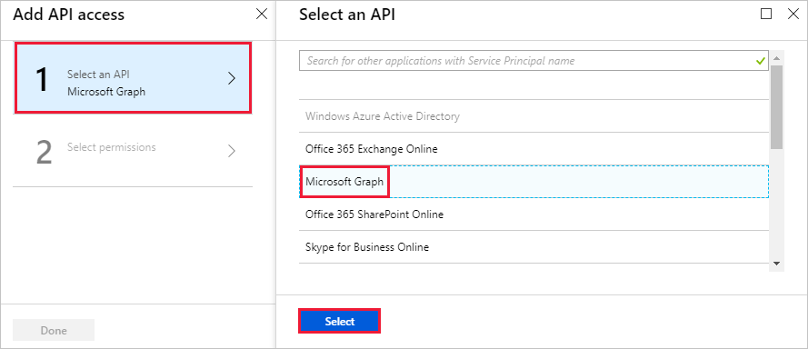

<!-- markdownlint-disable MD002 MD041 -->

在本练习中, 将创建一个新的 Azure Active Directory 应用程序, 该应用程序将用于为自定义连接器提供委派权限。In this exercise, you will create a new Azure Active Directory Application which will be used to provide the delegated permissions for the custom connector.

打开浏览器并导航到[Azure Active Directory 管理中心](https://aad.portal.azure.com)。Open a browser and navigate to [Azure Active Directory admin center](https://aad.portal.azure.com). 在左侧导航菜单中选择 " **Azure Active Directory** " 链接, 然后在**Azure active directory**边栏的 "**管理**" 部分中选择 "**应用注册**" 条目。Choose the **Azure Active Directory** link in the left navigation menu, then choose the **App registrations** entry in the **Manage** section of the **Azure Active Directory** blade.

选择 "**应用**注册" 边栏选项卡顶部的 "**新建应用程序注册**" 菜单项。Choose the **New application registration** menu item at the top of the **App Registrations** blade.

在`MS Graph Batch App` "**名称**" 字段中输入`https://localhost.com/$batch` , 并在 "**登录 URL** " 字段中输入, 然后选择 "**创建**"。Enter `MS Graph Batch App` in the **Name** field, and `https://localhost.com/$batch` in the **Sign-on URL** field and choose **Create**.

在 " **MS Graph 批处理应用**程序" 页上, 复制应用程序的**应用程序 ID** 。On the **MS Graph Batch App** page, copy the **Application ID** of the application. 在下一个练习中, 你将需要此操作。You'll need this in the next exercise.

在 "应用程序名称" 下选择 "**设置**" 齿轮, 然后选择 "设置" 边栏选项卡中的 "**所需权限**" 菜单项。Choose the **Settings** gear under the application name, then choose the **Required Permissions** menu item in the Settings blade. 选择 "**所需权限**" 边栏顶部的 "**添加**"。Choose **Add** at the top of the **Required Permissions** blade.

在 "**添加 api 访问**" 边栏中选择 "**选择 api** " 选项, 然后选择 " **Microsoft Graph** " 项目, 然后在 "刀片式服务器" 底部选择 "**选择**"。Choose the **Select an API** option in the **Add API access** blade, then select the **Microsoft Graph** item and choose **Select** at the bottom of the blade.

在 "**启用访问**" 边栏中, 向下滚动到 "**委派权限**" 部分。On the **Enable Access** blade, scroll down to the **Delegated Permissions** section. 选择 "**读取和写入所有组**委派权限", 然后选择刀片式服务器底部的 "**选择**"。Select the **Read and write all groups** delegated permission, then choose **Select** at the bottom of the blade. 在 "**添加 API 访问**" 边栏底部选择 "**完成**"。Choose **Done** at the bottom of the **Add API access** blade.

 

选择 "**设置**" 边栏选项卡上的 "**密钥**" 菜单项。Choose the **Keys** menu item on the **Settings** blade. 在`forever` "**键说明**" 中输入, 然后从 "**持续时间**" 下拉菜单中选择 "**从不过期**"。Enter `forever` in the **Key description** and select **Never expires** from the **Duration** drop down menu. 在 "**密钥**" 边栏顶部选择 "**保存**"。Choose **Save** at the top of the **Keys** blade. 复制新项的键值。Copy the key value for the new key. 在下一个练习中, 你将需要此操作。You'll need this in the next exercise.

> [!IMPORTANT]
> 此步骤非常关键, 因为关闭此边栏后将无法访问密钥。This step is critical as the key will not be accessible once you close this blade. 将此项保存到文本编辑器中, 以便在即将进行的练习中使用。Save this key to a text editor for use in upcoming exercises.

若要启用对通过 Microsoft Graph (包括团队属性) 访问的其他服务的管理, 需要选择其他更合适的范围以启用管理特定服务。To enable management of additional services accessible via the Microsoft Graph, including Teams properties, you would need to select additional, appropriate scopes to enable managing specific services. 例如, 若要扩展我们的解决方案以启用创建 OneNote 笔记本或 Planner 计划、存储桶和任务, 需要为相关 Api 添加所需的权限范围。For example, to extend our solution to enable creating OneNote Notebooks or Planner plans, buckets and tasks you would need to add the required permission scopes for the relevant APIs.