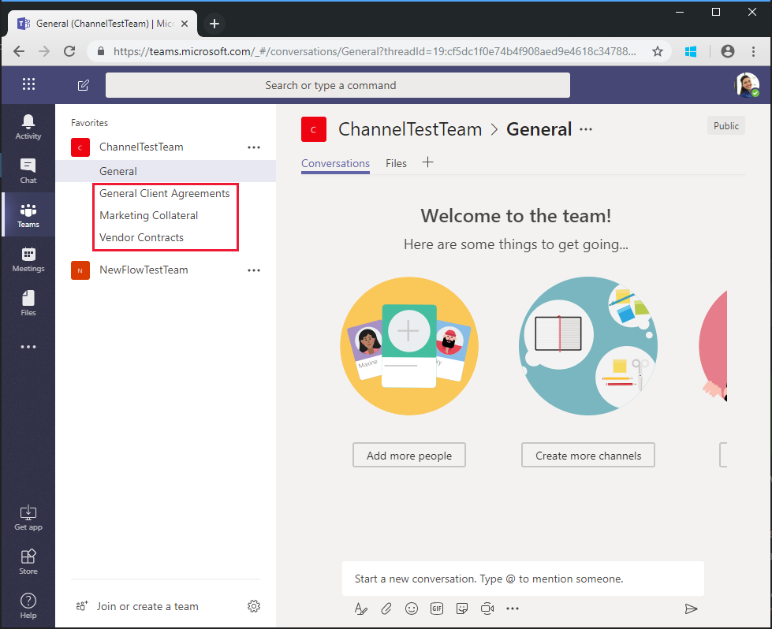

<!-- markdownlint-disable MD002 MD041 -->

<span data-ttu-id="65f9b-101">您在上一练习中创建的流使用`$batch` API 对 Microsoft Graph 发出两个单独的请求。</span><span class="sxs-lookup"><span data-stu-id="65f9b-101">The Flow you created in the previous exercise uses the `$batch` API to make two individual requests to the Microsoft Graph.</span></span> <span data-ttu-id="65f9b-102">通过这`$batch`种方式调用终结点可提供一些优点和灵活性, 但在一`$batch`次`$batch`调用中执行对 Microsoft Graph 的多个请求时, 终结点的真正威力也是如此。</span><span class="sxs-lookup"><span data-stu-id="65f9b-102">Calling the `$batch` endpoint this way provides some benefit and flexibility, but the true power of the `$batch` endpoint comes when executing multiple requests to Microsoft Graph in a single `$batch` call.</span></span> <span data-ttu-id="65f9b-103">在本练习中, 你将扩展创建统一组的示例, 并将团队关联起来, 以在一个`$batch`请求中为团队创建多个默认通道。</span><span class="sxs-lookup"><span data-stu-id="65f9b-103">In this exercise, you will extend the example of creating a Unified Group and associating a Team to include creating multiple default Channels for the Team in a single `$batch` request.</span></span>

<span data-ttu-id="65f9b-104">在浏览器中打开[Microsoft 流](https://flow.microsoft.com), 并使用 Office 365 租户管理员帐户登录。</span><span class="sxs-lookup"><span data-stu-id="65f9b-104">Open [Microsoft Flow](https://flow.microsoft.com) in your browser and sign in with your Office 365 tenant administrator account.</span></span> <span data-ttu-id="65f9b-105">选择您在上一步中创建的流, 然后选择 "**编辑**"。</span><span class="sxs-lookup"><span data-stu-id="65f9b-105">Select the Flow you created in the previous step and choose **Edit**.</span></span>

<span data-ttu-id="65f9b-106">选择 "**新建步骤**" `Batch` , 然后在搜索框中键入。</span><span class="sxs-lookup"><span data-stu-id="65f9b-106">Choose **New step** and type `Batch` in the search box.</span></span> <span data-ttu-id="65f9b-107">添加**MS Graph 批处理连接器**操作。</span><span class="sxs-lookup"><span data-stu-id="65f9b-107">Add the **MS Graph Batch Connector** action.</span></span> <span data-ttu-id="65f9b-108">选择省略号, 并将此操作重`Batch POST-channels`命名为。</span><span class="sxs-lookup"><span data-stu-id="65f9b-108">Choose the ellipsis and rename this action to `Batch POST-channels`.</span></span>

<span data-ttu-id="65f9b-109">将以下代码添加到操作的 "**正文**" 文本框中。</span><span class="sxs-lookup"><span data-stu-id="65f9b-109">Add the following code into the **body** text box of the action.</span></span>

```json
{
  "requests": [
    {
      "id": 1,
      "url": "/teams/REPLACE/channels",
      "headers": {
        "Content-Type": "application/json"
      },
      "method": "POST",
      "body": {
        "displayName": "Marketing Collateral",
        "description": "Marketing collateral and documentation."
      }
    },
    {
      "id": 2,
      "dependsOn": [
        "1"
      ],
      "url": "/teams/REPLACE/channels",
      "headers": {
        "Content-Type": "application/json"
      },
      "method": "POST",
      "body": {
        "displayName": "Vendor Contracts",
        "description": "Vendor documents, contracts, agreements and schedules."
      }
    },
    {
      "id": 3,
      "dependsOn": [
        "2"
      ],
      "url": "/teams/REPLACE/channels",
      "headers": {
        "Content-Type": "application/json"
      },
      "method": "POST",
      "body": {
        "displayName": "General Client Agreements",
        "description": "General Client documents and agreements."
      }
    }
  ]
}
```

<span data-ttu-id="65f9b-110">请注意, 上面的三个请求使用[dependsOn](https://docs.microsoft.com/graph/json-batching#sequencing-requests-with-the-dependson-property)属性来指定一个序列顺序, 每个请求都将执行一个 POST 请求, 以在新团队中创建新的通道。</span><span class="sxs-lookup"><span data-stu-id="65f9b-110">Notice the three requests above are using the [dependsOn](https://docs.microsoft.com/graph/json-batching#sequencing-requests-with-the-dependson-property) property to specify a sequence order, and each will execute a POST request to create a new channel in the new Team.</span></span>

<span data-ttu-id="65f9b-111">选择`REPLACE`占位符的每个实例, 然后选择 "动态内容" 窗格中的 "**表达式**"。</span><span class="sxs-lookup"><span data-stu-id="65f9b-111">Select each instance of the `REPLACE` placeholder, then select **Expression** in the dynamic content pane.</span></span> <span data-ttu-id="65f9b-112">将以下公式添加到**表达式**中。</span><span class="sxs-lookup"><span data-stu-id="65f9b-112">Add the following formula into the **Expression**.</span></span>

```js
body('Batch_PUT-team').responses[0].body.id
```


<span data-ttu-id="65f9b-114">选择 "**保存**", 然后选择 "**测试**" 以执行流。</span><span class="sxs-lookup"><span data-stu-id="65f9b-114">Choose **Save**, then choose **Test** to execute the Flow.</span></span> <span data-ttu-id="65f9b-115">选择 "**我将执行触发操作"** 单选按钮, 然后选择 "**保存 & 测试**"。</span><span class="sxs-lookup"><span data-stu-id="65f9b-115">Select the **I'll perform the trigger** action radio button, then choose **Save & Test**.</span></span> <span data-ttu-id="65f9b-116">在 "**名称**" 字段中输入一个不带空格的唯一组名称, 然后选择 "**运行流**" 以执行流。</span><span class="sxs-lookup"><span data-stu-id="65f9b-116">Enter a unique group name in the **Name** field without spaces, and choose **Run flow** to execute the Flow.</span></span>


<span data-ttu-id="65f9b-118">在流启动后, 选择 "**查看流运行活动**" 链接, 然后选择正在运行的流以查看活动日志。</span><span class="sxs-lookup"><span data-stu-id="65f9b-118">Once the Flow starts, choose the **See flow run activity** link, then choose the running Flow to see the activity log.</span></span>

<span data-ttu-id="65f9b-119">在流完成后, 对于创建的每个`Batch POST-channels`通道, 该操作的最终输出都具有 201 HTTP 状态响应。</span><span class="sxs-lookup"><span data-stu-id="65f9b-119">When the Flow completes, the final output for the `Batch POST-channels` action has a 201 HTTP Status response for each Channel created.</span></span>


<span data-ttu-id="65f9b-121">浏览到[Microsoft 团队](https://teams.microsoft.com), 并使用 Office 365 租户管理员帐户登录。</span><span class="sxs-lookup"><span data-stu-id="65f9b-121">Browse to [Microsoft Teams](https://teams.microsoft.com) and sign in with your Office 365 tenant administrator account.</span></span> <span data-ttu-id="65f9b-122">验证刚创建的团队是否显示并包含由`$batch`请求创建的三个通道。</span><span class="sxs-lookup"><span data-stu-id="65f9b-122">Verify that the team you just created appears and includes the three channels created by the `$batch` request.</span></span>



<span data-ttu-id="65f9b-124">虽然在本`Batch POST-channels`教程中实施了上述操作作为一个单独的操作, 但创建通道的调用可以作为`Batch PUT-team`操作中的其他调用添加。</span><span class="sxs-lookup"><span data-stu-id="65f9b-124">While the above `Batch POST-channels` action was implemented in this tutorial as a separate action, the calls to create the channels could have been added as additional calls in the `Batch PUT-team` action.</span></span> <span data-ttu-id="65f9b-125">这将在单个批次调用中创建团队和所有频道。</span><span class="sxs-lookup"><span data-stu-id="65f9b-125">This would have created the Team and all Channels in a single batch call.</span></span> <span data-ttu-id="65f9b-126">为此, 请再试一试。</span><span class="sxs-lookup"><span data-stu-id="65f9b-126">Give that a try on your own.</span></span>

<span data-ttu-id="65f9b-127">最后, 请记住, [JSON 批处理](https://docs.microsoft.com/graph/json-batching)调用将为每个请求返回一个 HTTP 状态代码。</span><span class="sxs-lookup"><span data-stu-id="65f9b-127">Finally, remember that [JSON Batching](https://docs.microsoft.com/graph/json-batching) calls will return an HTTP status code for each request.</span></span> <span data-ttu-id="65f9b-128">在生产过程中, 您可能希望将结果的后续处理与[`Apply to each`](https://docs.microsoft.com/flow/apply-to-each)操作组合在一起, 并验证每个单独的响应是否有201状态代码或补偿收到的任何其他状态代码。</span><span class="sxs-lookup"><span data-stu-id="65f9b-128">In a production process, you may want to combine post processing of the results with an [`Apply to each`](https://docs.microsoft.com/flow/apply-to-each) action and validate each individual response has a 201 status code or compensate for any other status codes received.</span></span>